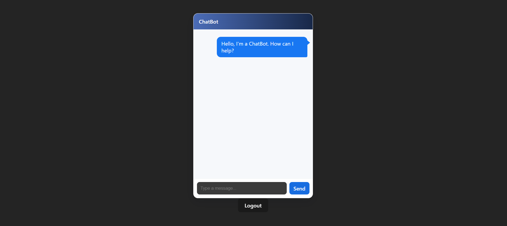
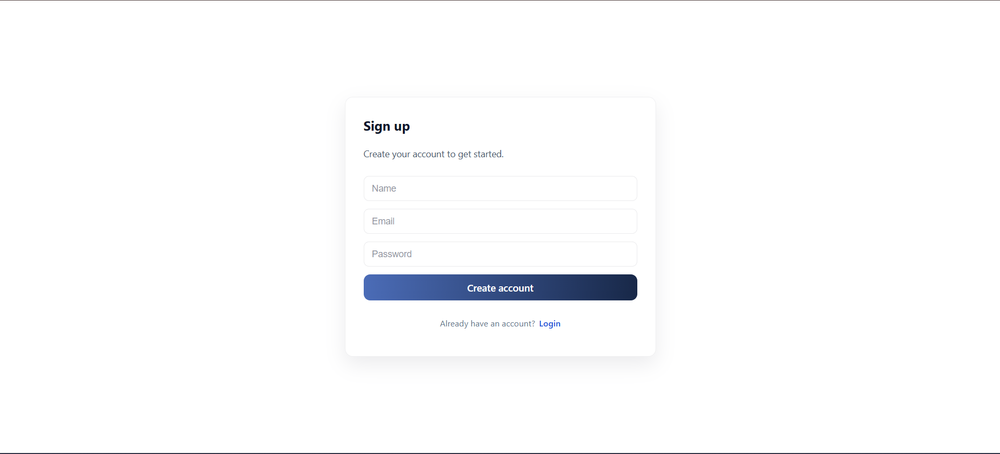
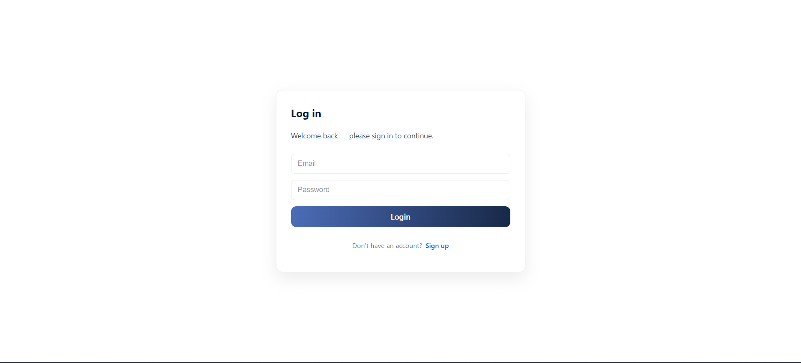

🤖 AI Chatbot Application

A full-stack AI-powered chatbot application with secure authentication, protected routes, and real-time conversational AI, built using modern web technologies.

📌 Overview

This project is a production-style full-stack application that allows users to:

Sign up and log in securely using JWT authentication

Access a protected AI chatbot dashboard

Interact with an AI model to get intelligent responses

Log out securely and manage sessions on the client side

The application demonstrates real-world authentication flow, API integration, and frontend–backend communication.

✨ Features

🔐 User Authentication

Signup & Login with hashed passwords

JWT-based session handling

Protected routes (Chat accessible only after login)

🤖 AI Chatbot

Real-time AI responses

Clean chat UI with auto-scroll

Secure API communication

🚪 Logout Functionality

Client-side JWT invalidation

Automatic redirect to login page

🧱 Scalable Architecture

Modular backend routes

Clean separation of concerns

🛠️ Tech Stack
Frontend

⚛️ React.js

🧭 React Router DOM

🎨 CSS (custom styling)

📦 Fetch API

Backend

🟢 Node.js

🚀 Express.js

🔐 JSON Web Token (JWT)

🔑 bcryptjs (password hashing)

Database

🍃 MongoDB

🧩 Mongoose ODM

AI Integration

🤖 Google Gemini API

AI-powered conversational responses

Development & Tooling

dotenv (environment variables)

CORS

Git & GitHub

📷 Screenshots
🔹 Chatbot Dashboard

🔹 User Signup Page

🔹 User Login Page

🔐 Authentication Flow
Signup → Password Hashing → MongoDB
Login → JWT Issued → Stored in localStorage
Protected Routes → JWT Verified
Logout → Token Removed → Redirect to Login

⚙️ Environment Variables

Create a .env file in the backend directory using the following format:

MONGO_URI=your_mongodb_connection_string
JWT_SECRET=your_jwt_secret
GEMINI_API_KEY=your_gemini_api_key

⚠️ Never commit .env files to GitHub
A .env.example file is provided for reference.

🚀 Getting Started
1️⃣ Clone the Repository
git clone https://github.com/your-username/CHAT-BOT.git

2️⃣ Install Dependencies

Backend

cd server
npm install

Frontend

cd client
npm install

3️⃣ Run the Application

Backend

npm start

Frontend

npm run dev

📁 Project Structure
CHAT-BOT/
├── client/        # React frontend
├── server/        # Node + Express backend
│   ├── routes/
│   ├── models/
│   ├── middleware/
│   └── index.js
├── screenshots/
├── .env.example
├── .gitignore
└── README.md

🧠 Key Learnings

Implemented secure authentication using JWT

Integrated third-party AI APIs

Handled real-world debugging scenarios

Built protected routes and session logic

Followed best practices for environment security

📌 Resume Highlight

Built a full-stack AI chatbot using React, Node.js, Express, MongoDB, and JWT authentication, featuring secure login/signup, protected routes, and real-time AI-powered conversations using the Gemini API.

🔮 Future Improvements

Chat history persistence

Refresh token implementation

UI/UX enhancements

File upload support

Deployment (Vercel + Render)

👤 Author
Kaushik Baruah

Kaushik Baruah
Computer Science & Engineering
Full-Stack Developer (MERN)
